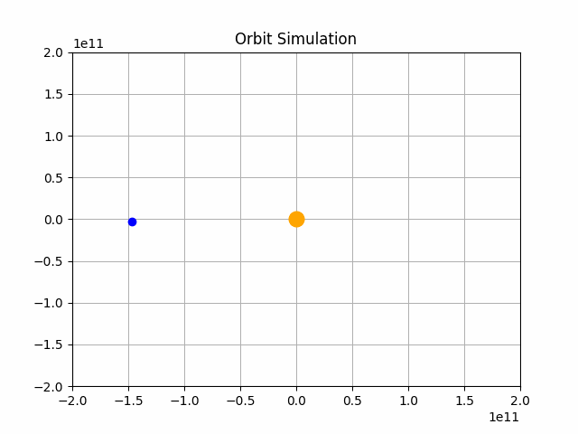

# Planetary Orbit Simulation

Models the orbits of planets.
Uses Matplotlib for visualization.

Used Math and Theories from:

* A Western Illinois University [report](http://www.wiu.edu/cas/mathematics_and_philosophy/graduate/equations-planetary-motion.pdf).
* A Temple University class's [final project](https://sites.temple.edu/math5061/).
